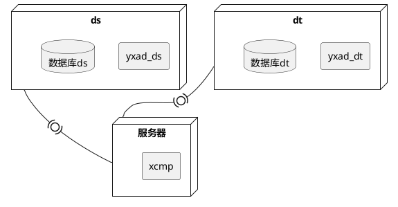
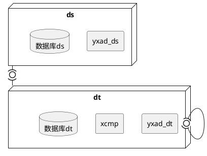
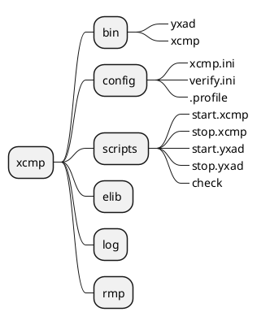

# 1.  XCMP 使用说明

# 2. xcmp比对工具简介

## 2.1. 工具简介
Xcmp工具支持全量比对，增量比对（oracle、db2），中间机比对，不必部署realsync。 支持比对内容： 数据，表结构，条数，分区，字段，可按照条件配置比对内容。

### 2.1.1. 支持比对的数据库：
Oracle, MySQL, PostgreSQL, GreenPlum SQL Server, DB2, Informix, Sybase, Caché

### 2.1.2. 比对需要用到的程序 ：
| 程序 |                                说明                                |
| ---- | ------------------------------------------------------------------ |
| Yxad | 分别放置在源端和目标端，用于连接数据库，导出数据，计算crc值并发送给xcmp |
| Xcmp | 执行比对                                                            |


## 2.2. 操作步骤
1. 源端和目标端分别执行yxad -c确认程序是否可以连接数据库。
2. 源端执行start_yxad脚本，目标端执行start_yxad脚本，执行check脚本确认程序都启动且日志无报错。
3. 在比对端执行xcmp.sh脚本运行比对程序，在log.xcmp日志中查看比对过程及结果。
4. 在dbps_home/rmp/result/html下查看不一致数据。

# 3. 原理说明
## 3.1. 全量比对原理
1. 导出表数据计算CRC，不会存在order by操作。
2. 顺序导出，oxad (kxad, yxad, pxad ...)负责表数据导出，导出后立刻计算每行数据CRC，然后将CRC和ROWID数据传给xcmp。具体表数据不会在网络上传输，所以低带宽 对于性能影响不大。
3. 按照CRC排序。
4. 比较CRC排序后的CRC数据，如果不一直再根据具体的CRC数据找ROWID去，
人工比较具体那条数据不一致，可以找得到对应ROWID的
## 3.2. 增量比对原理
增量比对，也就是在上次不一致数据的基础上再做一次比对，不会对历史原来已经确认为一致的数据再比对了。
1. 查询比对记录表，得到哪些数据需要做增量比对。将所有信息导出到自己的home目录下面.sql文件中。
2. 在源端和目标端分别创建两个表,把需要比对的信息insert到这个表里面。
3. 结合TMP_XCMP_*表和需要比对表查询出具体每行数据，并计算出CRC。
4. 比对新导出的数据的CRC了。最后把不一致的结果重新insert到dsg.check_tab_list里面。
## 3.3. 数据修复原理
	yloader内部嵌入xcmp，xcmp会把源端和目标端不一致的记录导出成xdt，然后自动调用yloader先删除目标端不一致数据，然后加载源端导出的xdt来完成修复。

# 4. 比对模式说明
- 模式1:



- 模式2:



+ 模式一：
 yxad程序和数据库在同一台服务器。
 xcmp程序在另一台服务器，即不在源端和目标端执行比对。
+ 模式二：
 yxad程序和数据库在同一台服务器。
 xcmp程序在目标端。

::: alert-info
Yxad程序最好和数据库在同一台服务器。否则会导致数据在网络传输，极大程度增加比对时间。
Xcmp会在所在服务器执行比对，所以会有部分cpu占用，现场可根据服务器实际情况决定xcmp是否部署在目标端。
:::

# 5. 目录架构




bin:
存放程序，yxad程序用于查询、导出数据，xcmp程序用于执行比对。
源端和目标端需要yxad程序，执行比对的主机需要xcmp程序。
（可在源端或目标端执行比对）
Config:
Xcmp.ini：记录源端和目标端的配置信息，以及比对配置信息。放置在执行比对的主机。
Verify.ini：记录比对的数据。
.profile：记录源端或目标端的信息。
Scritps：
Start_yxad：启动yxad的脚本。
Stop_yxad：停止yxad。
Check：检查进程是否启动。
Xcmp.sh：执行比对的脚本。
Stop_yxad：停止比对。
Elib:
存放比对程序所用的lib文件。
Log:
存放生成的日志信息。
在比对主机会生成log.xcmp，该日志末端记录比对结果。
Rmp:
存放缓存数据的目录，也在此存放不一致数据rowid信息。
# 6. 文件配置
## 6.1. .profile文件  

```
export DBPS_HOME=/dsg/wanglu/tmp/tmp/zjdt236/xcmp          //存放比对文件的路径
export YXAD_HOST=192.168.1.176                           //yxad所在主机的ip地址
export YXAD_PORT=54321                                  //yxad端口号，自己定
export LOCAL_ORACLE_SID=db11       
export LOCAL_ORACLE_HOME=/dsg/app/oracle/product/11.2.0/db_1       //非oracle为空
export LD_LIBRARY_PATH=/dsg/wanglu/tmp/tmp/zjdt236/xcmp/elib/oracle  //库文件路径
export USERNAME=dsg                                      //连接数据库的用户名
export PASSWD=dsg                                         //连接数据库的密码 
```
## 6.2. xcmp.ini文件  

```
# 7. fetch table data from db
  module=FTD
  home=/dsg/wanglu/tmp/tmp/zjdt236/xcmp/rmp     # xcmp work directory 
  map_file=/dsg/wanglu/config/verify.ini           # xcmp used map config filename     
map_split=y                                 # need split map partition table? (y/n)  
# 8. y表示将分区表拆分成分区比对

  # simple compare result save: CHECK_TAB_DIFF*
  # detail compare result save: CHECK_TAB_LIST*
  source_schema=wltest   				# saved TMP_XCMP_* table schema name  
# 9. 源端临时表会保存在这个用户下
  target_schema=dsglu   				# saved CHECK_TAB_DIFF table schema name  									# 目标端生成的表会保存在这个用户下
  queue_name=dsg   					# saved CHECK_TAB_DIFF*, for multiple xcmp  									# 比对结果表后缀名

  nthr=2        						# running thread count 导出表的线程数
  print=0       						# print log level (0, 1, 2 ...) 
  parallel=8     						# select /*+parallel(c, parallel) ...  查询数据并行数
  exec_hint=0   						# Oracle exec sql hint. (1 - ALL_ROWS, 2 - RULE)
  diff_filesize=1024M      			#不一致数据很多或比对数据量较大时可根据实									际存储空间扩展此参数值。
#如1024M，10240M。如果.diff文件大小超过这个	值，则不继续记录rowid 
select_thread=1   					# 比对大数据量时设置，
# 10. 数据量小的表设置反而降低比对速度。
#范围1-64，一般设置为1-3即可，仅适用于oracle
max_table=81920   					#设置比对表最大数据，最大设置10240000  
blen_expand=30M   				#设置扩展的内存
  clear_rspace=y      				#去除数据的空格影响
  temp_table_do=R    				#temp table do. 对比对过程临时表的操作
(R-drop,T-truncate,D- delete,U-unused)
                    				#设置U不创建临时表，同时不能实现数据修复
  lang=utf8, 0        #目前仅支持oracle数据库。指定字符集让oxad取出数据进行字符集转换。#此例表示源端导出数据后转换为utf8，目标端不进行转换。
                     #可以转换为utf8及gbk  eg：lang=0,gbk 
clear_time=f                        #设置为f，不比对微秒


# 11. configure for connect Oracle by yxad
  module=OXAC.S                    #源端配置
  service=192.168.1.176,12345          #源端yxad主机ip，端口，逗号分隔不能有空格
  oracle_home=/dsg/app/oracle/product/11.2.0/db_1  #非oracle数据库为空即可
  oracle_sid=db11                     #数据库sid ,比对异构数据库此处为数据库名   
oracle_tns=                   

  # check $ORA_LOGIN_FILE file for force changed usr/pwd login.
  oracle_usr=wltest                    # login  user  
  oracle_pwd=wltest                   # password (pwdcrypt encrypted)
  encrypt_pwd=n                     #密码是否加密，如果为y，上面的密码需要是密文
oracle_pdb=db12pdb                 #12c pdb名称，非12c为空即可
  sysdba=n                          # connect Oracle by SYSDBA?(Y|N)
  sysasm=n                          # connect Oracle by SYSASM?(Y|N)

# 12. configure for connect Oracle by yxad     #以下为目标端配置，同上
  module=OXAC.T
  service=192.168.1.176,54321           
  oracle_home=/dsg/app/oracle/product/11.2.0/db_1   
  oracle_sid=db11                   
  oracle_tns=db236                   

  # check $ORA_LOGIN_FILE file for force changed usr/pwd login.
  oracle_usr=dsglu             
  oracle_pwd=dsglu              

  encrypt_pwd=n     
  oracle_pdb=        
  sysdba=n                                       
  sysasm=n              

```
## 6.3. verify.ini文件

该文件存放于执行比对的主机，记录比对内容

|                                                                                                         书写方式                                                                                                          |          含义           |
| ------------------------------------------------------------------------------------------------------------------------------------------------------------------------------------------------------------------------ | ----------------------- |
| oracle                                                                                                                                                                                                                   | dsuser=>dtuser          |
| Mysqlsqlserver                                                                                                                                                                                                           | Dsdatabase=>dtdatabase  |
| Db2Postgresqlcache                                                                                                                                                                                                       | Schema=>schema          |
| ds.t1 => dt.t1                                                                                                                                                                                                           | 比对表                  |
| DS.T1.P1 => DT.TX.P1                                                                                                                                                                                                     | 比对分区                 |
| DS.T1 \[ID>100\] =\> DT.T2 \[ID>100\]DS.T1 \[ID>100 and name=’rose’\] =\> DT.T2 \[ID>100 and name=’rose’\]DS.C\_METER \[INST\_DATE<to\_date('2009109','YMDD')\] => DT.C\_METER \[INST\_DATE<to\_date('2009109','YMDD')\] | 按条件比对               |
| DS.T1 (ID,AGE,NAME) => DT.T2 (ID,AGE,NAME)                                                                                                                                                                               | 比对字段                 |
| DS.T1 !(ID, AGE) => DT.T2 !(ID, AGE)                                                                                                                                                                                     | 排除某字段比对           |
| DS.T1 (ID, AGE) \[ID>30\] => DT.T2 (ID, AGE) \[ID>30\]                                                                                                                                                                   | 按条件比对字段           |
| 无rowid数据库(eg mysql)                                                                                                                                                                                                   | Ds.t1@key => dt.t1 @key |
| DS.T1 (ID,NAME) @ID \[ID=30\] =>DT.T1 (ID,NAME) @ID \[ID=30\]                                                                                                                                                            | 按条件比对字段           |
## 6.4. start.xcmp脚本
该文件存放于执行比对的主机，作用是通过执行该脚本，执行比对。

主要执行语句：
```console
${DBPS_HOME}/bin/xcmp -c_xcmp -v0123 -f $DBPS_HOME/config/xcmp.ini -t dia -nthr 2 -id -1 -task 'f' -flog ${DBPS_HOME}/log/log.xcmp 2>&1 &
```
          

|     参数      |                                   功能                                    |
| ------------- | ------------------------------------------------------------------------- |
| -c_xcmp       | 使用ylaoder程序时添加-c_xcmp，使用xcmp程序时删除该参数。                     |
| -v0123        | 查看详细日志。当log.xcmp遇到报错时，可添加-v0123查看详细日志重新比对排查错误。 |
| -t d          | 比对数据                                                                   |
| -t t          | 比对表结构                                                                 |
| -t r          | 比对count                                                                 |
| -t x          | 修复数据。需要使用yloader程序                                               |
| -t m          | 修复rowmap。                                                               |
| -task ’f,0,b’ | f为全量比对，b为增量比对，0表示两次比对间隔0min，可根据实际需求扩展。          |
## 6.5. start.yxad脚本
用于启动yxad，非oracle数据库在此配置字符集。
可配置-lang utf8 或 -lang gbk
Eg:
```console
nohup $DBPS_HOME/bin/db2/yxad -v013 -home $DBPS_HOME/txad_home -startup -lang uft8 -n ${YXAD_HOST}:${YXAD_PORT} -blen 30M >> $DBPS_HOME/log/log.yxad.${YXAD_PORT} 2>&1 &
```

          

|      参数      |                                            功能                                             |
| -------------- | ------------------------------------------------------------------------------------------ |
| -v0123-v013    | 查看详细日志。数据量小时加-v0123查看详细日志排除错误如果数据量很大，配置-v013，否则输出日志会很大 |
| -lang utf8/gbk | 非oracle数据库配置字符集，可配置utf8或者gbk                                                   |

# 7. 比对结果
## 7.1. 查看结果日志
Log.xcmp日志最下方有展示。
Eg:
 
T 结果一致/ F结果不一致

源端不一致数据 count，目标端不一致数据 count，源端表数据 count，目标端表数据 count。
如果出现-1，代表没找到该表，配置无误的话，观察log.xcmp和log.yxad日志报错。

## 7.2. 查看结果表
结果表：目标端CHECK_TAB_DIFF_*  
该表存放于xcmp.ini文件target_schema所填的用户下
## 7.3. 查看不一致数据信息
文件记录在执行比对主机的DBPS_HOME/rmp/result/html下
Eg:

# 8. 修复数据
**简要说明|**

实际执行数据修复的是yloader程序，使用该程序时，在xcmp.sh脚本中增加-c_xcmp参数，同时-t添加x参数，表示修复数据。
支持修复的数据库：
     Oracle, DB2, PostgreSQL, GreenPlumn，mysql，sqlserver，informix，cache
Eg:
```console

 ${DBPS_HOME}/bin/xcmp -c_xcmp -f $DBPS_HOME/config/xcmp.ini -t daix -nthr 2 -id -1 -task 'f' -flog ${DBPS_HOME}/log/log.xcmp 2>&1 &
```
## 8.1. 修复原理
yloader内部嵌入xcmp，xcmp会把源端和目标端不一致的记录导出成xdt，然后自动调用yloader先删除目标端不一致数据，然后加载源端导出的xdt来完成修复。

注意点
:::alert-warning
Mysql数据库无rowid，所以想要修复mysql数据时，需要强制指定主键列为rowid。
Verify.ini/map.ini文件写法：

源端用户.表名(列名, 列名, ... ) SCN @强制设置为ROWID [ WHERE条件 ] => 目标用户.表名(列名， ...) SCN @强制设置为ROWID [ WHERE条件]
:::
## 8.2. 修复结果
log.xcmp结果追加R代表修复过该表，修复完成后，建议再次比对，查看数据是否完全一致。


## 8.3. 修复rowmap
** 简要说明| **
修复rowmap支持oracle数据库，在创建rowmap前xcmp会做数据比对，确认两边数据一致才会成功创建rowmap。
使用示例

- config/xcmp.ini需要配置：
```
module=FTD
  	rowmap_dir=/tmp/dsg/r1   #配置输出rowmap目录
```
+ xcmp.sh脚本配置：
```
xcmp -f xcmp.ini -t m
```


# 9. 非oracle数据库参数配置
以下配置均是和oracle数据库配置不同处，相同配置未再次说明。
          

## 9.1. Mysql

          

|    <br>    |            <br>            |                          <br>                           |
| ---------- | -------------------------- | ------------------------------------------------------- |
| config.ini | source_schematarget_schema | 配置数据库名称。比对产生的临时表及结果表会创建到该数据库下。 |
|            | oracle_sid                 | yxad连接的数据库名                                       |
|            | oracle_home                | 为空。如果是rds数据库，则将连接串写到此处                  |
|            | oracel_tns                 | 为空                                                     |
|            | oracle_usroracle_pwd       | 连接mysql数据库的用户名和密码                             |
| verify.ini | ds.t1=>dt.t1               | datebase.table=>database.table                          |
|            | ds.t1@key => dt.t1 @key    | 如果想展示不一致数据以及修复，需要写 @主键                 |
## 9.2. sqlserver
          

|    <br>    |            <br>            |                                       <br>                                        |
| ---------- | -------------------------- | --------------------------------------------------------------------------------- |
| config.ini | source_schematarget_schema | 配置schema名称。（如果创表未指定那就写dbo）比对产生的临时表及结果表会创建到该schema下。 |
|            | oracle_sid                 | dsn数据源名称                                                                      |
|            | oracle_home                | 比对数据库库名                                                                      |
|            | oracel_tns                 | 为空                                                                               |
|            | oracle_usroracle_pwd       | 连接sqlserver数据库的用户名和密码                                                   |
| verify.ini | ds.t1=>dt.t1               | schema.table=>schema.table如果创表时未指定schema，就写dbo.t1=>dbo.t1                |
          

## 9.3. Informix&Caché

|    <br>    |            <br>            |                           <br>                           |
| ---------- | -------------------------- | -------------------------------------------------------- |
| Config.ini | Source_schemaTarget_schema | 配置schema名称。比对产生的临时表及结果表会创建到该schema下。 |
|            | Oracle_sid                 | 填写odbcname                                              |
|            | Oracle_home                | 为空                                                      |
|            | Oracel_tns                 | 为空                                                      |
|            | Oracle_usroracle_pwd       | 连接informix/Caché的用户名和密码                           |
| Verify.ini | Ds.t1=>dt.t1               | Schema.table=>schema.table                               |

:::alert-warning
 注：只能比对连接的odbc相对应数据库的数据
 注：informix分区表没rowid，如果想展示不一致数据，需要手工为表添加rowid：alter table schema.table add rowids; 
:::
          

# 10. 附-比对过程中临时表、结果表
          

|     |       表名        |                                         作用                                         |
| --- | ----------------- | ----------------------------------------------------------------------------------- |
| Ds  | tmp\_xcmp\_s*     | 临时表，记录比对过程中不一致数据rowid。根据xcmp.ini文件temp\_tab\_do配置是否创建或删除。 |
| Dt  | check\_tab\_diff* |                                                                                     |
|     | check\_tab\_list* | 结果表，记录比对详细结果（表结构如下）                                                 |
|     | tmp\_xcmp\_t* 。  | 临时表，记录比对过程中不一致数据rowid。根据xcmp.ini文件temp\_tab\_do配置是否创建或删除   |


```sql
SQL> desc dsg.check_tab_list;
 Name    Type
 ---------------- -------------------------------
 HID             NUMBER(38) #比对主版本号
 LID           NUMBER(38) #比对次版本号，增量比对主版本号一致，次版本号自动增加。
 SRC_TGT        CHAR(1) # S - 表示源端表， T - 表示目标端表
 OWNER_NAME   VARCHAR2(128) #比对的用户名
 TABLE_NAME     VARCHAR2(128) #比对的表名
 CHECK_TIME     DATE #比对时间 
 PK_CRC         VARCHAR2(8) #比对表的PK计算出来的CRC, 0表示没有PK/UK
 ROW_CRC       VARCHAR2(8) #比对数据的行CRC数据
 ROWID_VALUE   VARCHAR2(128) #改行数据的ROWID值
 STATUS_VALUE   CHAR(1)
```

xcmp指定了-t a，对应会把比对不一致的详细信息insert到目标端这个表里面。

```sql
SQL> desc CHECK_TAB_DIFFDSG
 Name					   Null?    Type
 ----------------------------------------- -------- ----------------------------
 SRC_OWNER					    VARCHAR2(128)
 SRC_TABLE_NAME 				    VARCHAR2(128)
 TGT_OWNER					    VARCHAR2(128)
 TGT_TABLE_NAME 				    VARCHAR2(128)
 CHECK_TIME					    DATE
 CHECK_STATUS					    CHAR(1)
 SRC_COUNT					        NUMBER
 TGT_COUNT					        NUMBER
 DIFF_COUNT					    VARCHAR2(32)
 SRC_DIFF_INFO					    CLOB
 TGT_DIFF_INFO					    CLOB

```
xcmp指定了-t di
比较具体数据的时候可以把不一致的数据ROWID插入到SRC_DIFF_INFO和TGT_DIFF_INFO字段中
          

# 11. 附-log.xcmp过程日志简介

```sql

[oracle@train2 log]$ vi log.xcmp 
================================
2019-04-29:13:58:42  do task: f        //表明进行什么任务，增量比对为b

--------------------------------
2019-04-29:13:58:42  do task: full
Linux train2 2.6.18-308.el5 #1 SMP Fri Jan 27 17:17:51 EST 2012 x86_64 x86_64 x86_64 GNU/Linux

2019-04-29:13:58:42  DSG DMP service (XCMP) pid: 20007 ...

connect 192.168.1.210:12346 - KXA
2019-04-29:13:58:42  yxac pool init, 20,20, blen 647168 ...

        check SQL Server ver: 12
2019-04-29:13:58:42  yxac  open yid ee31309c, 192.168.1.210:12346, idx 0,19...
2019-04-29:13:58:42  yxac fclose yid ee31309c, idx 0,19...
sd 5, total send size 0, speed 0.00MB/s
13:58:42  T#4159350464, close socket-sd:5
13:58:42  T#4159350464, close socket-sd:4
2019-04-29:13:58:42  connect source database (MSSQL) pool used buffer 0.     
//yxad连接ds数据库
13:58:42  T#4159350464, stp_connect 192.168.1.177 - 64321 ...
connect 192.168.1.177:64321 - OXA
13:58:42  T#4159350464, close socket-sd:4
2019-04-29:13:58:42  connect target database (Oracle) pool used buffer 2164.   
//yxad连接dt数据库
13:58:42  T#4159350464, stp_connect 192.168.1.177 - 64321 ...               
13:58:43  T#4159350464, stp_connect 192.168.1.210 - 12346 ...               
2019-04-29:13:58:43  yxac  open yid ee31309c, 192.168.1.210:12346, idx 0,19...


13:58:43  P#20007, T#4159350464-OXAC-SPSQL-0>
select nvl(max(hid),0) from TVERIFY2.CHECK_TAB_LISTDSG
13:58:43  P#20007, T#4159350464-OXAC-RSTR-3>34
2019-04-29:13:58:43  T#1  xexp start, blen 131.02MB ...
2019-04-29:13:58:43  [1/1] T  xexp dict ...                     //yxad导出dt字典
2019-04-29:13:58:43  [1/1] S  xexp dict ...                     //yxad导出ds字典
2019-04-29:13:58:43  [1/1] S  xexp dict ok, used 0.00s.         //字典导出完成标志
2019-04-29:13:58:43  [1/1] T  xexp dict ok, used 0.01s.
2019-04-29:13:58:43  [1/1] T "TVERIFY1"."TT3" xcrc open ...      
//yxad准备导出dt数据，导出同时计算每行crc
2019-04-29:13:58:43  [1/1] S "dbo"."tt3" xcrc open ...
2019-04-29:13:58:43  [1/1] T "TVERIFY1"."TT3" xcrc rows 7, used 0.01s.  
//yxad已将dt端crc和rowid传给xcmp
2019-04-29:13:58:43 sh>[cat /dsg/xcmp/rmp/target/TVERIFY1.TT3.0.crc|awk {'print $1'}|sort -T /dsg/xcmp/rmp/sort_tmp/ >/dsg/xcmp/rmp/target/TVERIFY1.TT3.0.crc.sort]              
//xcmp对dt端crc进行排序
2019-04-29:13:58:43  [1/1] S "dbo"."tt3" xcrc rows 7, used 0.01s. 
//yxad已将ds端crc和rowid传给xcmp
2019-04-29:13:58:43 sh>[cat /dsg/xcmp/rmp/source/dbo.tt3.0.crc|awk {'print $1'}|sort -T /dsg/xcmp/rmp/sort_tmp/ >/dsg/xcmp/rmp/source/dbo.tt3.0.crc.sort]                 
//xcmp对ds端crc进行排序

2019-04-29:13:58:43  file /dsg/xcmp/rmp/source/dbo.tt3.0.crc sort used 0.01s.     
//xcmp已完成ds端crc排序
2019-04-29:13:58:43  file /dsg/xcmp/rmp/target/TVERIFY1.TT3.0.crc sort used 0.01s. 
//xcmp已完成dt端crc排序
2019-04-29:13:58:43 sh>[diff /dsg/xcmp/rmp/source/dbo.tt3.0.crc.sort /dsg/xcmp/rmp/target/TVERIFY1.TT3.0.crc.sort >/dsg/xcmp/rmp/source/dbo.tt3.0.crc.diff]
//比对源端和目标端排序后的crc
2019-04-29:13:58:43  create diff /dsg/xcmp/rmp/source/dbo.tt3.0.crc.diff file used 0.00s
/dsg/xcmp/rmp/source/dbo.tt3.0.crc.diff, s-nrow 2, t-nrow 2          
//将源端不一致数据crc记录在文件
2019-04-29:13:58:43  diff file /dsg/xcmp/rmp/source/dbo.tt3.0.crc.diff replace used 0.00s
//根据不一致crc逐条找到rowid信息，对于不一致数据特别多的时候可能会非常耗时。

13:58:43  P#20007, T#4159350464-OXAC-SPSQL-0>
truncate table TVERIFY2.TMP_XCMP_T1DSG   
//如果比对前临时表存在，就truncate，如果不存在就create。源端和目标端都会进行这个操作(这个信息同时可以在yxad日志中看到)
13:58:43  T#4159350464, stp_connect 192.168.1.177 - 64321 ...
13:58:43  sd 7 x33-sql49>insert into TVERIFY2.TMP_XCMP_T1DSG(C) values(?)
//将不一致数据rowid信息insert到目标端临时表

sd 7, TVERIFY2.TMP_XCMP_T1DSG(I) bind ncol 1, nrow 2   , dlen 125/125   (0.006 / 0.006)s
13:58:43  sd 7 yxac-sql>commit
sd 7, total send size 125, speed 0.02MB/s
13:58:43  T#4159350464, close socket-sd:7


13:58:43  P#20007, T#4159350464-OXAC-SPSQL-0>

13:58:43  sd 6 x23-sql101>select count(*) from sysobjects where xtype='U' and name='tmp_xcmp_s1dsg' and 
SCHEMA_NAME(uid)='dbo'

13:58:43  sd 6 x23-sql35>truncate table dbo.tmp_xcmp_s1dsg
//truncate源端临时表

13:58:43  sd 6 yxac-sql>commit
13:58:43  T#4159350464, stp_connect 192.168.1.210 - 12346 ...
13:58:43  sd 7 x33-sql44>insert into dbo.tmp_xcmp_s1dsg(C) values(?)
//将不一致信息insert到源端临时表中
sd 7, dbo.tmp_xcmp_s1dsg(I) bind ncol 1, nrow 2   , dlen 106/106        (0.002 / 0.002)s
13:58:43  T#4159350464, close socket-sd:7
2019-04-29:13:58:43  [1/1] T#1  "dbo"."tt3" 7 => "TVERIFY1"."TT3" 7 crc different!!!

13:58:43  T#4159350464, stp_connect 192.168.1.177 - 64321 ...
13:58:43  T#4067785616, stp_connect 192.168.1.210 - 12346 ...
2019-04-29:13:58:43  yxac  open yid ee31309c, 192.168.1.210:12346, idx 0,18...
13:58:43  sd 8 x23-sql13>use [wl_tmp]

13:58:43  sd 8 x23-sql101>select count(*) from sysobjects where xtype='U' and name='tmp_xcmp_s1dsg' and 
SCHEMA_NAME(uid)='dbo'

2019-04-29:13:58:43  [1/1] S "dbo"."tt3" acrc open ...
2019-04-29:13:58:43  [1/1] S "dbo"."tt3" acrc rows 2, used 0.01s.
2019-04-29:13:58:43  [1/1] T "TVERIFY1"."TT3" acrc open ...
2019-04-29:13:58:43  [1/1] T "TVERIFY1"."TT3" acrc rows 2, used 0.02s.
13:58:43  sd 6 x23-sql13>use [wl_tmp]

2019-04-29:13:58:43  [1/1] T "TVERIFY1"."TT3" fxdt open ...
13:58:43  sd 6 x23-sql101>select count(*) from sysobjects where xtype='U' and name='tmp_xcmp_s1dsg' and SCHEMA_NAME(uid)='dbo'

2019-04-29:13:58:43  [1/1] S "dbo"."tt3" fxdt open ...
2019-04-29:13:58:43  [1/1] T "TVERIFY1"."TT3" fxdt rows 2, used 0.01s.
2019-04-29:13:58:43  [1/1] S "dbo"."tt3" fxdt rows 2, used 0.00s.
//将源端和目标端的不一致数据信息导出为xdt文件，为数据修复使用。
13:58:43  T#4159350464, stp_connect 192.168.1.177 - 64321 ...
13:58:43  sd 9 x33-sql213>insert into TVERIFY2.CHECK_TAB_DIFFDSG(SRC_OWNER, SRC_TABLE_NAME, TGT_OWNER, TGT_TABLE_NAME, CHECK_TIME, CHECK_STATUS, SRC_COUNT, TGT_COUNT, DIFF_COUNT, SRC_DIFF_INFO, TGT_DIFF_INFO) values(?,?,?,?,?,?,?,?,?,?,?)

sd 9, TVERIFY2.CHECK_TAB_DIFFDSG(I) bind ncol 11, nrow 1   , dlen 567/567       (0.001 / 0.001)s
13:58:43  sd 9 yxac-sql>commit
sd 9, total send size 567, speed 0.54MB/s
13:58:43  T#4159350464, close socket-sd:9


13:58:43  P#20007, T#4159350464-OXAC-SPSQL-0>
commit
13:58:43  T#4159350464, stp_connect 192.168.1.177 - 64321 ...
13:58:43 sd 10 x33-sql142>insert into TVERIFY2.CHECK_TAB_LISTDSG(HID,LID,SRC_TGT,OWNER_NAME,TABLE_NAME,
CHECK_TIME,PK_CRC,ROW_CRC,ROWID_VALUE) values(?,?,?,?,?,?,?,?,?)
//将不一致数据信息insert到check_tab_list表
sd 10, TVERIFY2.CHECK_TAB_LISTDSG(I) bind ncol 9, nrow 4   , dlen 682/682       (0.001 / 0.001)s
13:58:43  sd 10 yxac-sql>commit
sd 10, total send size 682, speed 0.65MB/s
13:58:43  T#4159350464, close socket-sd:10

13:58:43  P#20007, T#4159350464-OXAC-SPSQL-0>
commit
13:58:43  sd 8 x23-sql13>use [wl_tmp]

13:58:43  sd 8 x23-sql101>select count(*) from sysobjects where xtype='U' and name='tmp_xcmp_s1dsg' and SCHEMA_NAME(uid)='dbo'

13:58:43  sd 8 x23-sql35>truncate table dbo.tmp_xcmp_s1dsg
//比对完成后，truncate临时表。这个操作可以在xcmp.ini temp_tab_do设置。
13:58:43  sd 8 yxac-sql>commit


13:58:43  P#20007, T#4159350464-OXAC-SPSQL-0>
truncate table TVERIFY2.TMP_XCMP_T1DSG
//比对完成后，truncate临时表。这个操作可以在xcmp.ini temp_tab_do设置。
2019-04-29:13:58:43  T#1  xexp end.

2019-04-29:13:58:43  xcmp compare result list:
        html result: /dsg/wanglu/tmp/tmp/dt_ora1/xcmp/rmp/result/html/comp.html
        xml  result: /dsg/wanglu/tmp/tmp/dt_ora1/xcmp/rmp/result/html/comp.xml
        result format: (T/F, source_diff_rows,target_diff_rows,source_rows,target_rows)
        T - compare consistent
        F - compared inconsistent
+------+--------------+-------------+-------------+
|F-NUM |SOURCE TABLE |TARGET TABLE |RESULT       |
+------+--------------+-------------+-------------+
|1      |dbo.tt3         |TVERIFY1.TT3  |F, 2, 2, 7, 7   |
+------+--------------+-------------+-------------+
//比对总结果
        xcmp end. used 0.47s

2019-04-29:13:58:43  yxac pool term ...
2019-04-29:13:58:43  yxac fclose yid ee31309c, idx 0,18...
sd 8, total send size 0, speed 0.00MB/s
13:58:43  T#4159350464, close socket-sd:8
2019-04-29:13:58:43  yxac fclose yid ee31309c, idx 0,19...
sd 6, total send size 0, speed 0.00MB/s
13:58:43  T#4159350464, close socket-sd:6
13:58:43  T#4159350464, close socket-sd:4
13:58:43  T#4159350464, close socket-sd:7
13:58:44  oxac run close idle exit.
        xcmp all task end. used 1.75s


```
# 12. 附件:
## 12.1. 说明文档在线版

## 12.2. 安装脚本下载地址

# 13. 一键修复脚本

